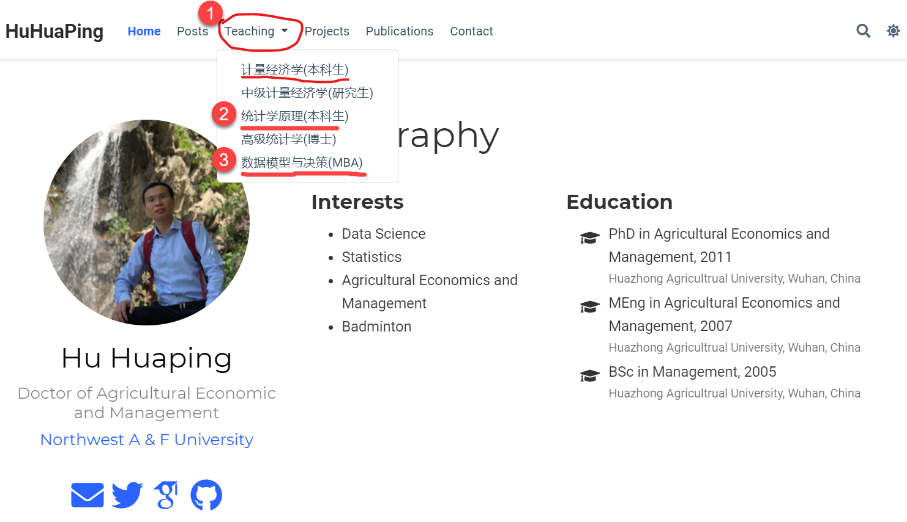
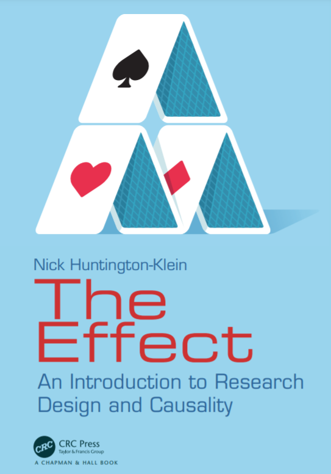
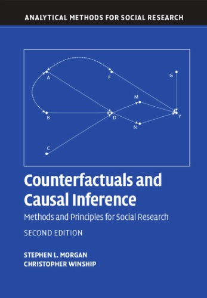
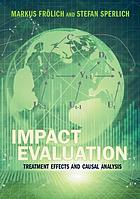
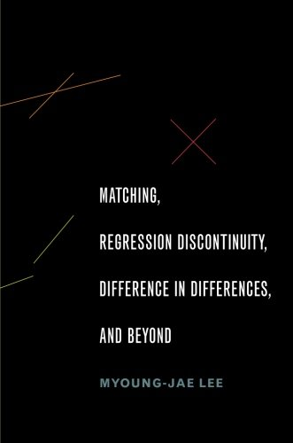
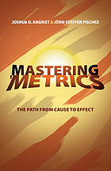
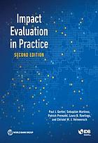

---
params:
  hideslide: FALSE
output:
  xaringan::moon_reader:
    seal: false
    lib_dir: libs
    css:
      - default
      - ../mycss/my-theme.css 
      - ../mycss/my-font.css
      - ../mycss/my-custom-for-video-roomy.css
      - ../mycss/text-box.css
      - duke-blue
      - hygge-duke
    nature:
      highlightStyle: github
      highlightLines: true
      countIncrementalSlides: false
      ratio: "16:9"
---
background-image: url("../pic/slide-front-page.jpg")
class: center,middle
exclude: `r params$hideslide`

# 高级计量暑期班</br></br>(Seminar of Advanced Econometrics)

<!---    chakra: libs/remark-latest.min.js --->

### 胡华平

### 西北农林科技大学

### 经济管理学院数量经济教研室

### huhuaping01@hotmail.com

### `r Sys.Date()`


```{r , echo=F,message=FALSE,warning=F, eval=!params$hideslide}
source("../R/set-global.R")
source("../R/xfun.R", encoding = "UTF-8")
source("../R/external-math-equation.R")
options(width = 70)
# for bib reference
source("../R/ref-bib.R")
```

```{r xaringan-logo, echo=FALSE}
require('xaringanExtra')

xaringanExtra::use_tachyons()

xaringanExtra::use_panelset()

xaringanExtra::use_logo(
  image_url = "../pic/logo/nwafu-logo-circle-wb.png",
  height = '70px',
  position = xaringanExtra::css_position(top='0.2em',left="1em")
)
```

---
class: center, middle, duke-orange,hide_logo
name:chapter

# 第00章：课程说明

### [0.1 师生互动](#comu)

### [0.2 教材资料](#text)

### [0.3 软件材料](#software)

### [0.4 考核方式](#eval)

### [0.5 理论课内容](#theory)

### [0.6 实验课内容](#lab)

---
layout: false
class: center, middle, duke-orange,hide_logo
name: comu

# 0.1 师生互动

### 在线平台

### 在线资源

---
layout: true

<div class="my-header-h2"></div>

<div class="watermark1"></div>

<div class="watermark2"></div>

<div class="watermark3"></div>

<div class="my-footer"><span>huhuaping@  &emsp;&emsp; <a href="#chapter"> 第00章 课程说明 </a>
&emsp;&emsp;&emsp;&emsp;&emsp;&emsp;&emsp;&emsp;&emsp;&emsp;&emsp;&emsp;&emsp;&emsp;&emsp;&emsp;&emsp;&emsp;&emsp;&emsp;&emsp;&emsp;&emsp;&emsp;&emsp;&emsp;
<a href="#comu"> 0.1 师生互动 </a> </span></div> 

---

## 在线平台1：胡华平的个人网站

- 使用浏览器（chrome或360极速浏览器）登陆胡华平个人网站<sup>*</sup>。

> 国内线路：[https://home.huhuaping.com/](https://home.huhuaping.com/)。更新频率较低，但是国内访问速度快！

> 国际线路：[https://huhuaping.com/](https://huhuaping.com/)。实时更新，国内用户访问速度受限，但是国外用户访问速度快！


.footnote[.red[**说明**：<sup>*</sup> 
- 个人开发的独立网站，应用R编程语言和Rmarkdown语言开发建设；

- 只要设备能联网，就等浏览课程资源（建议使用chrome浏览器）；

- 连接速度根据你的电信供应商而定。]
]

---

## 在线平台1：胡华平的个人网站

- 点击首页导航栏**Teaching**，然后点击**高级计量（暑期班）**。

```{r, out.height='500px'}

```


---

## 在线平台1：胡华平的个人网站

手机视图界面下，需要点击网站导航.red[**三道杠**]。

```{r, out.width= "450px"}

```

---
exclude: true

## 在线平台2：学校平台

西北农林科技大学**在线教育综合平台**，我的课程**《统计学原理》（胡华平）**在平台上运行多年。[链接](https://eol.nwafu.edu.cn/meol/jpk/course/layout/newpage/index.jsp?courseId=42427)


```{r}
include_graphics("../pic/chpt00-course-university-stat.png",dpi = 220)
```

.footnote[.red[**说明**：1.外网可以访问；2.手机端暂时不支持]]

---
exclude: true
## 在线平台2：学校平台

西北农林科技大学**在线教育综合平台**，登陆方式：

- 门户登陆（**建议**）：西农首页
$\Rightarrow$（登陆）信息综合服务平台
$\Rightarrow$（点击进入）在线教育综合平台
$\Rightarrow$（选择课程）《统计学原理》（胡华平）


```{r,out.width='750px'}

```


---

## 在线资源

出版商DYNAMIC IDEAS出版的系列运筹战略图书（[点击链接](https://www.dynamic-ideas.com/books?category=Operations+Strategy)）

- Bertsimas D, Dunn J.  Machine learning under a modern optimization lens[M]. Belmont, Massachusetts: Dynamic Ideas, 2019.


---

exclude: true

## 在线资源


```{r, out.width='800px', fig.align='left'}

```

.pull-left[

**课程资源**：

- 教学课件（课堂ppt、实验指导书...）
- 统计软件（SPSS、mathtype、office...）
- 参考图书

]

.pull-right[

**教学活动**：

- 实验上机作业
- 实验指导视频...
- 教学答疑
]


---
layout: false
class: center, middle, duke-orange,hide_logo
name: text

# 0.2 教材资料

---
layout: true

<div class="my-header-h2"></div>

<div class="watermark1"></div>

<div class="watermark2"></div>

<div class="watermark3"></div>

<div class="my-footer"><span>huhuaping@  &emsp;&emsp; <a href="#chapter"> 第00章 课程说明 </a>
&emsp;&emsp;&emsp;&emsp;&emsp;&emsp;&emsp;&emsp;&emsp;&emsp;&emsp;&emsp;&emsp;&emsp;&emsp;&emsp;&emsp;&emsp;&emsp;&emsp;&emsp;&emsp;&emsp;&emsp;&emsp;&emsp;
<a href="#text"> 0.2 教材资料 </a> </span></div> 

---

### 参考教材《效应：研究设计与因果性概论》

- Huntington-Klein N.  The effect: an introduction to research design and causality[M]. Boca Raton, FL:CRC Press, 2022. （[online free](https://theeffectbook.net/)）

```{r, out.width='220px'}

```


.footnote[

可参看配套的代码资源：[github repo](https://github.com/NickCH-K/causaldata)

]

---

### 参考教材《因果推断：锦盒》

- Cunningham S.  Causal Inference: The Mixtape[M]. Yale University Press, 2021.（可以参看外文出版商的[书籍网页](https://www.scunning.com/mixtape.html)）<sup>a</sup>

```{r, out.width='250px'}
include_graphics("../pic/chpt00-text-scott-cover.jpg")
```

.footnote[

<sup>a</sup> 可参看配套“Causal Inference: The Mixtape”`r Citep(bib, "cunningham2021")`的在线资源：[github repo](https://github.com/scunning1975/mixtape)

]


---

### 参考教材《反事实和因果推断》

- Morgan S L, Winship C.  Counterfactuals and causal inference: methods and principles for social research[M]. 第2nd版. New York, NY: Cambridge University Press, 2014.


```{r, out.width='250px'}

```

---

### 参考教材《影响评估、处置效应及因果分析》

- Frohlich M, Sperlich S. Impact evaluation, treatment effects and causal analysis[M]. New York:  Cambridge University Press, 2019.

```{r, out.width='250px'}

```

---

### 参考教材《匹配、断点回归、双重差分及其扩展》

- Lee M.  Matching, regression discontinuity, difference in differences, and beyond[M]. New York: Oxford University Press, 2016. 

```{r, out.width='250px'}

```

.footnote[
韩国学者编写。附带stata代码（参看[google个人站点](https://sites.google.com/site/mjleeku/data-and-gaussstata-programs-for-2016-book-oup)）。

]

---

### 参考教材《精通"测度"：原因-效果路径》

- Angrist J D, Pischke J-S.  Mastering ’Metrics: The Path from Cause to Effect[M]. Princeton, Oxford: Princeton University Press, 2015.


```{r, out.width='250px'}

```

---

### 参考教材《影响评估实践应用》

- Gertler P, Martinez Wilde S, Premand P, Rawlings L, Vermeersch C. Inter-American Development Bank.  Impact evaluation in practice[M]. 第2nd版.  Washington, DC: World Bank Group, 2016.<sup>a</sup>

```{r, out.width='250px'}

```

.footnote[
<sup>a</sup> 可以参看相关[在线资源](https://evalsp20.classes.andrewheiss.com/)

]


---

## 在线资源：政策评估相关


在线learning sources:

- online book chapter "13 Experiments and Quasi-Experiments"（[see](https://www.econometrics-with-r.org/13-eaqe.html)）

- "Chapter 12 Regression Discontinuity: Looking for Jumps in Data" （[see](https://bookdown.org/carillitony/bailey/chp11.html#same-slope)）

- 在线课程"program evaluation"。[课程网址](https://evalsp20.classes.andrewheiss.com/schedule/)。chapter Regression discontinuity I & II（[链接](https://evalsp20.classes.andrewheiss.com/class/11-class/)）。有视频有R案例和代码。


---

## 在线资源：DID相关

- DID的资源[汇集](https://asjadnaqvi.github.io/DiD/)，能否打开网页根据你的网络环境而定


---
layout: false
class: center, middle, duke-orange,hide_logo
name: software

# 0.3 软件材料

---
layout: true

<div class="my-header-h2"></div>

<div class="watermark1"></div>

<div class="watermark2"></div>

<div class="watermark3"></div>

<div class="my-footer"><span>huhuaping@  &emsp;&emsp; <a href="#chapter"> 第00章 课程说明 </a>
&emsp;&emsp;&emsp;&emsp;&emsp;&emsp;&emsp;&emsp;&emsp;&emsp;&emsp;&emsp;&emsp;&emsp;&emsp;&emsp;&emsp;&emsp;&emsp;&emsp;&emsp;&emsp;&emsp;&emsp;&emsp;&emsp;
<a href="#software"> 0.3 软件材料 </a> </span></div> 


---

## 课程指定软件


（1）课程指定软件：管理科学家软件(Management Scientist Tool)

- 实验室版本：Management Scientist Tool `6.0`

- 软件下载和安装：课堂上课说明。

- 因为电脑操作系统的原因，可能会出现兼容性问题而无法使用。课堂上说明怎么解决！


（2）课程指定软件：**Microsoft Excel**

- 实验室版本：Excel 2013版以上

???

- 软件参考使用书：

> Excel入门应试，可参考国内田海霞教材。
 
> Excel精通掌握，可参考：
- Glyn, Davis, Branko, Pecar.Statistics for Business Students: A Guide to Using Excel & IBM SPSS Statistics [M].2021. ISBN:9781637957622
- Alexander, M. Excel Dashboards and Reports for Dummies 3rd [M], Wiley, 2016.


可以参看youtube安装说明[视频](https://www.youtube.com/watch?v=5TZY90dpQWk)


---

## 自学一门软件

自学编程语言1：开源**R软件**（选用，自学）

- Tilman, Davies.The book of R: a first course in programming and statistics[M]. 	San Francisco : No Starch Press, 2016.

- Adler. R in a Nutshell (2ed)  [M], Reilly, 2012.

- Crawley. The R Book (2nd) [M], Wiley,2013.

自学编程语言2：开源**Python**（选用，自学）

自学编程语言3：商业**stata软件**（选用，自学）：


---
layout: false
class: center, middle, duke-orange,hide_logo
name: eval

# 0.4 考核方式

---
layout: true

<div class="my-header-h2"></div>

<div class="watermark1"></div>

<div class="watermark2"></div>

<div class="watermark3"></div>

<div class="my-footer"><span>huhuaping@  &emsp;&emsp; <a href="#chapter"> 第00章 课程说明 </a>
&emsp;&emsp;&emsp;&emsp;&emsp;&emsp;&emsp;&emsp;&emsp;&emsp;&emsp;&emsp;&emsp;&emsp;&emsp;&emsp;&emsp;&emsp;&emsp;&emsp;&emsp;&emsp;&emsp;&emsp;&emsp;&emsp;
<a href="#eval"> 0.4 考核方式 </a> </span></div> 

---

## 考核方式

- 实操训练

- 论文汇报


---
layout: false
class: center, middle, duke-orange,hide_logo
name: theory

# 0.5 理论课内容

---
layout: true

<div class="my-header-h2"></div>

<div class="watermark1"></div>

<div class="watermark2"></div>

<div class="watermark3"></div>

<div class="my-footer"><span>huhuaping@  &emsp;&emsp; <a href="#chapter"> 第00章 课程说明 </a>
&emsp;&emsp;&emsp;&emsp;&emsp;&emsp;&emsp;&emsp;&emsp;&emsp;&emsp;&emsp;&emsp;&emsp;&emsp;&emsp;&emsp;&emsp;&emsp;&emsp;&emsp;&emsp;&emsp;&emsp;&emsp;&emsp;
<a href="#theory"> 0.5 理论课内容 </a> </span></div> 

---

## 理论课章节（60学时）

.bold[

- 专题一、工具变量（IV）法

- 专题二、倾向匹配法（PSM）

- 专题三、内生转换模型（ESR）

- .red[专题四、倍差法（DID）（胡华平）]

- .red[专题五、断点回归法(RD)（胡华平）]

- 专题六、影响评估学术论文一般思路

]

---
layout: false
class: center, middle, duke-orange,hide_logo
name: lab

# 0.6 实践课安排

---
layout: true

<div class="my-header-h2"></div>

<div class="watermark1"></div>

<div class="watermark2"></div>

<div class="watermark3"></div>

<div class="my-footer"><span>huhuaping@  &emsp;&emsp; <a href="#chapter"> 第00章 课程说明 </a>
&emsp;&emsp;&emsp;&emsp;&emsp;&emsp;&emsp;&emsp;&emsp;&emsp;&emsp;&emsp;&emsp;&emsp;&emsp;&emsp;&emsp;&emsp;&emsp;&emsp;&emsp;&emsp;&emsp;&emsp;&emsp;&emsp;
<a href="#lab"> 0.6 实验课安排 </a> </span></div> 

---


## 实践内容

```{r lab-arrange, eval=FALSE}
lab <- tribble(~"实验主题",
"Excel 基础",
"数据收集和整理",
"图表制作进阶1",
"图表制作进阶2",
"相关和回归分析",
"综合统计分析报告")
lab <- lab %>% 
  add_column("序号"=paste("Lab",1:6),
             .before = "实验主题")  %>%
  add_column("学时"=c(rep(3,4), rep(2,2))) %>%
  add_column("周次"=str_c("第",11:16, "周"))
  
#kable(lab, caption = "实验课（32学时）内容安排")

DT::datatable(lab)

```


- 课外小组案例讨论和准备

- 咨询诊断大作业

???

.footnote[.red[**注意**：<sup>*</sup> 
- 实验作业发布和提交全部在学校**在线教育综合平台**完成！请尽快登陆课程网站，确认自己登陆进去。
- 每次作业发布都会有开始和截至时间，系统会自动记录，过期不候，不交作业则没有相应实验成绩（实验成绩占最终课程成绩的30%）。]
]


---
layout: false
class: center, middle, duke-orange,hide_logo
name: reference-ch01

# 本章参考文献

---
layout: true

<div class="my-header-h2"></div>

<div class="watermark1"></div>

<div class="watermark2"></div>

<div class="watermark3"></div>

<div class="my-footer"><span>huhuaping@  &emsp;&emsp; <a href="#chapter"> 第00章 课程说明 </a>
&emsp;&emsp;&emsp;&emsp;&emsp;&emsp;&emsp;&emsp;&emsp;&emsp;&emsp;&emsp;&emsp;&emsp;&emsp;&emsp;&emsp;&emsp;&emsp;&emsp;&emsp;&emsp;&emsp;&emsp;&emsp;&emsp;
<a href="#reference-ch01"> 本章参考文献 </a> </span></div> 

---

### 参考文献（References）

.page-font-22[

```{r, results='asis', echo=FALSE}

#RefManageR::PrintBibliography(bib)

# also we can use custom function
print_bib_rmd(bib, start = 1)

```

]

---
layout:false
background-image: url("../pic/thank-you-gif-funny-fan.gif")
class: inverse, center

# 本章结束
